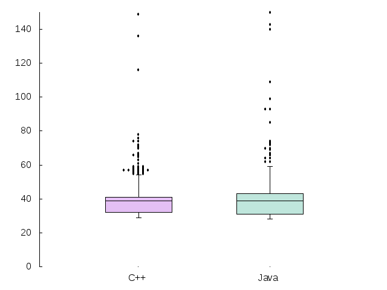

# benchmarking massive data streams

First, we send a number to the echo server which doubles the value and adds 1,
then sends this back to the caller. This is repeated n times.
Second, the time is measured with a high-precision clock for the complete
sending and receiving path. This measurements are kept in an array which is then
sorted and output to a file.

# evaluation

Using **gnuplot** we analyse the time measurements with a boxplot.
This shows nicely in the box the expected time for a quarter, half, three quarters of the
total measurements. Additionally, atop are drawn the outliers which take
excessively long to return.


# example

```
> ./echo/c++/EchoServer_Release 11234 &

> java -jar ./echo/java/EchoServer.jar &

> ./caller/CallerServer_Release_1_0 localhost 24937 0 10000
 after 10000 repetitions: 18 < 26 < 349 us (10^-6 seconds)
 after 10000 repetitions: min: 18 q1[2500]: 24 median[5000]: 25 q3[7500]: 27 max: 349 us (10^-6 seconds)

> ./caller/CallerServer_Release_1_0 localhost 11234 0 10000
 after 10000 repetitions: 18 < 25 < 197 us (10^-6 seconds)
 after 10000 repetitions: min: 18 q1[2500]: 19 median[5000]: 21 q3[7500]: 31 max: 197 us (10^-6 seconds)

```


